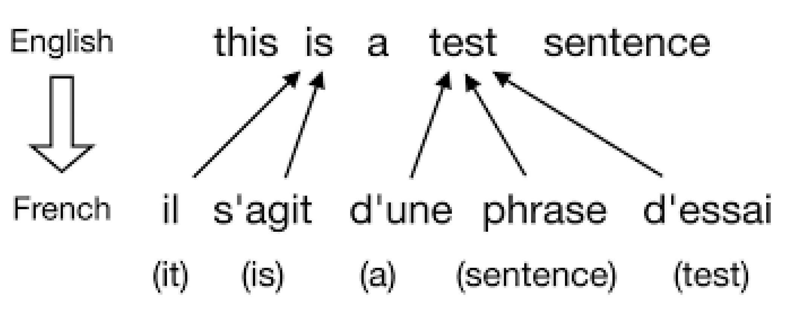
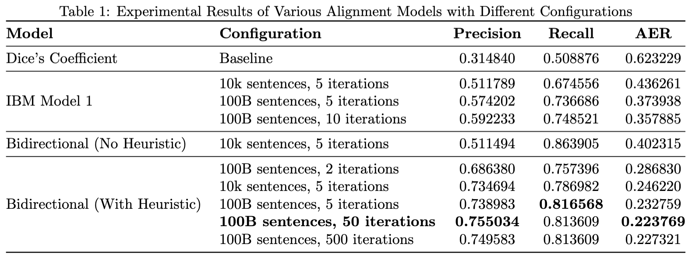

# Word Alignment Models for Machine Translation

This repository contains implementations of various word alignment models for machine translation, including Dice's Coefficient, IBM Model 1, and a Bidirectional model with the grow-diag-final-and heuristic. These models aim to improve alignment quality for better machine translation results.

## Table of Contents

- [Overview](#overview)
- [Requirements](#requirements)
- [Installation](#installation)
- [Usage](#usage)
- [File Descriptions](#file-descriptions)
- [Example](#example)
- [Results](#results)
- [Contributing](#contributing)
- [License](#license)
- [Copyright](#copyright)

## Overview

Word alignment is a crucial step in statistical machine translation. It is the process of assigning word or phrases of one language to another, upon consideration of reordering and context. An example can be seen below:



The simplest and most naive form of alignment is to assign the same index to both the languages for a particular word. However, there exists advanced algorithms to handle this, but this is still an active research area. This project implements and compares several alignment models:

1. Dice's Coefficient (baseline)
2. IBM Model 1
3. Bidirectional IBM Model 1 with grow-diag-final-and heuristic

Key features:
- Multiple alignment models for comparison
- Customizable number of iterations and dataset size
- Evaluation using Alignment Error Rate (AER)

## Requirements

- Python 3.7+
- Git

## Installation

1. Clone the repository:
   ```
   git clone https://github.com/junayed-hasan/word-alignment-techniques-in-machine-translation.git
   cd word-alignment-techniques-in-machine-translation
   ```

2. (Optional) Create and activate a virtual environment:
   ```
   python -m venv venv
   source venv/bin/activate  # On Windows, use `venv\Scripts\activate`
   ```

## Usage

To run the different alignment models:

1. Dice's Coefficient:
   ```
   python align > dice_alignments.txt
   ```

2. IBM Model 1:
   ```
   python ibm_align > ibm_alignments.txt
   ```

3. Bidirectional Model:
   ```
   python bidirectional_align > bidirectional_alignments.txt
   ```

Options:
- `-n`, `--num_sentences`: Number of sentences to use (default: all)
- `-i`, `--num_iterations`: Number of training iterations (default: 5)

To evaluate the alignments:

```
python [alignment_script] [options] | python score-alignments
```

## File Descriptions

- `align`: Script for Dice's Coefficient alignment
- `ibm_align`: Script for IBM Model 1 alignment
- `bidirectional_align`: Script for Bidirectional IBM Model 1 with grow-diag-final-and heuristic
- `score-alignments`: Script to evaluate alignment quality using AER
- `check-alignments`: Script to verify the format of alignment files
- `data/`: Folder containing input data files
  - `hansards.f`: French sentences
  - `hansards.e`: English sentences
  - `hansards.a`: Gold standard alignments
- `example.ipynb`: Jupyter notebook with example usage and results

## Example

For a detailed example of how to use the alignment models and interpret the results, please refer to the `example.ipynb` notebook in this repository.

## Results

Our experiments show significant improvements in alignment quality across models:



For a complete breakdown of results and analysis, please refer to the `example.ipynb` notebook.

## Contributing

Contributions to this project are welcome! Please follow these steps:

1. Fork the repository
2. Create a new branch (`git checkout -b feature/your-feature`)
3. Make your changes and commit them (`git commit -am 'Add some feature'`)
4. Push to the branch (`git push origin feature/your-feature`)
5. Create a new Pull Request

## License

This project is licensed under the MIT License - see the [LICENSE](LICENSE) file for details.

## Copyright

© 2024 Mohammad Junayed Hasan. All rights reserved.
